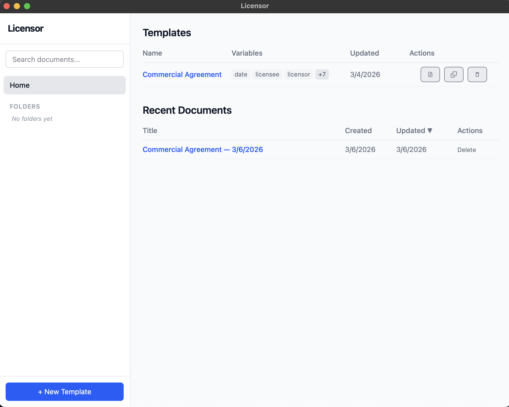
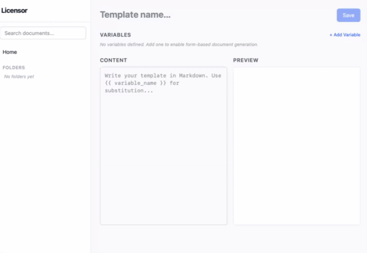
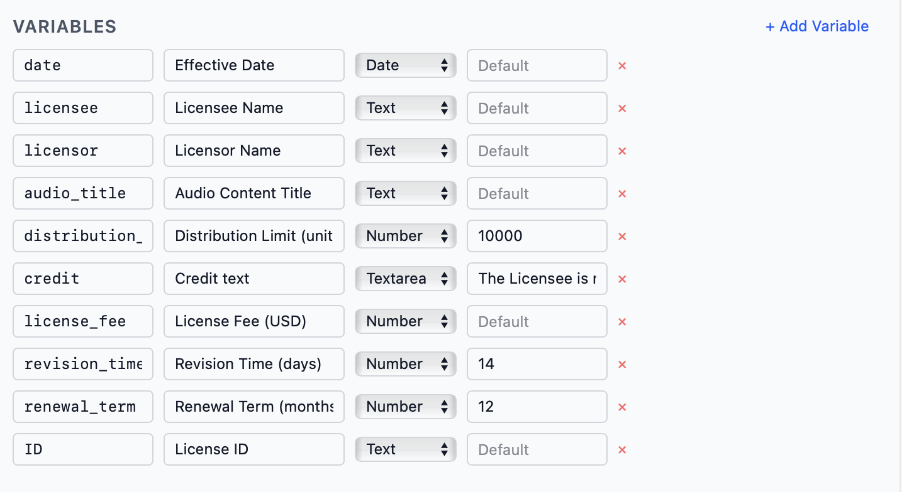
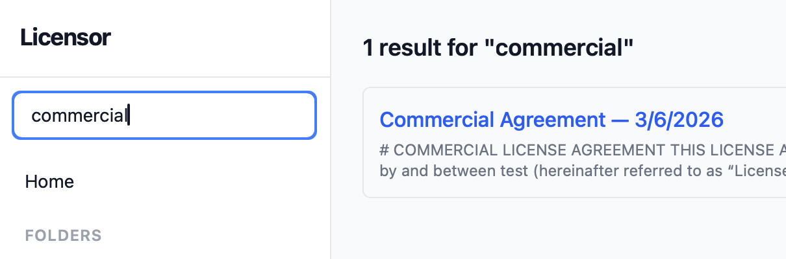
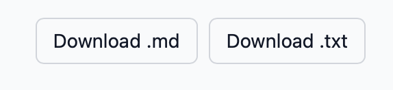
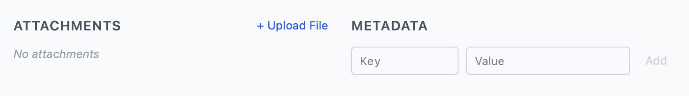

# Licensor

A desktop app for managing document templates with variable substitution, rendering, and export capabilities.

---

- [Contributing](.github/CONTRIBUTING.md)
- [GNU GPLv3 License](LICENSE)

Base templates are stored in the [`templates/`](app/templates/) directory as Markdown files with YAML front matter defining the template name, description, and variables. See [example.md](app/templates/example.md) and [commercial.md](app/templates/commercial.md) for reference.

## Examples & References

- [Creating a template](#creating-a-template)
- [Template variables](#template-variables)
- [Searching](#searching)
- [Exporting a document](#exporting-a-document)
- [Documents can have metadata/files](#documents-can-have-metadatafiles)

---

##### Creating a template

- You can create a new template from scratch or clone an existing one.

##### Template variables

- Can have a type: `text`, `textarea`, `number`, `date`.
- Can be marked as *`required`* or have a **`default`** value.
- These are denoted by double curly braces within the content, e.g., `{{variable_name}}`.

##### Searching

- You can use the search bar to search for templates/documents.
- The search matches against any content within the documents/templates.

##### Exporting a document

- You can download the rendered document in either `.md` (Markdown) or `.txt` (Plain Text) formats.

##### Documents can have metadata/files

- You can add metadata to documents, which is saved alongside the rendered document.
- This can be for organizational purposes or to store additional information.

